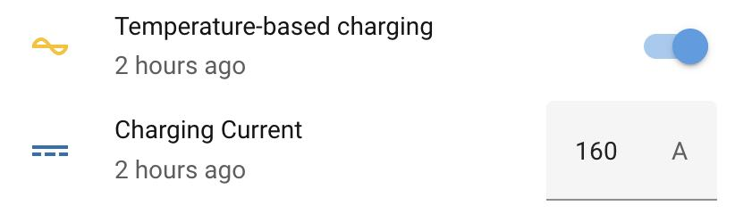
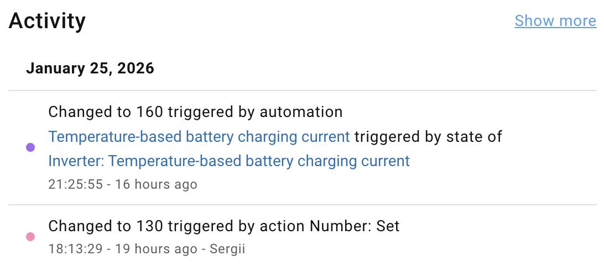

# Temperature-based battery charging current

This automation will maintain the optimal charging current without your involvement. The general rules are:
- `<= 5°C` - don't charge
- `>5` - charge from `0.005C` to `0.5C`

## Dependencies

- A Deye inverter
- Home Assistant's [Solarman Integration](https://github.com/davidrapan/ha-solarman)

## Create an automation

> [!TIP]
> Settings -> Automations & scenes -> Create automation

Before proceeding, ensure your entity IDs first:
- `sensor.inverter_battery_temperature` - the Solarman's sensor indicating the battery temperature.
- `number.inverter_battery_capacity` - the Solarman's input indicating the battery pack total capacity.
- `number.inverter_battery_max_charging_current` - the Solarman's input indicating the battery max charging current.

> [!IMPORTANT]
> **ADJUST THIS OR YOU MAY DAMAGE YOUR BATTERY!**
>
> Locate the `` part and set the value you're comfortable with. This will be the max-max regardless of the C-rate. I.e., I have two 300 Ah batteries, making the total capacity of 600 Ah, which is 1C. The 0.5C will be 300, but I never want such a high current, hence the hard limit is set to 160 manually (~0.26C).

The logic of the automation is as follows:
- subtract 5 Celsius degrees from the battery temperature and multiply the result by 0.05 to get the charging C-rate, e.g.
  - `(18-5)*0.05=0.65`
  - `(10-5)*0.05=0.25`
  - `(9-5)*0.05=0.2`
  - `(8-5)*0.05=0.15`
  - `(5-5)*0.05=0` (don't charge)
  - `(2-5)*0.05=-0.15` (don't charge)
- if the C-rate is below 0 - assume 0
- if the C-rate is above 0.5 - assume 0.5 to restrict non-recommended charging currents
- multiply total battery pack capacity by the C-rate to get the current in Amperes
- if the computed charging current exceeds the hard limit set manually, use the hard-limited value
- if the computed charging current does not exceed the hard limit set manually, use the computed value

```yaml
alias: Temperature-based battery charging current
description: Adjust battery charging current based on its temperature
triggers:
  - entity_id: sensor.inverter_battery_temperature
    trigger: state
  - entity_id: number.inverter_battery_capacity
    trigger: state
conditions: []
actions:
  - delay:
      seconds: 30
  - target:
      entity_id: number.inverter_battery_max_charging_current
    data:
      value: >
        {# Battery temperature #}
        

        {# 1C - total capacity in Ah #}
        

        {# Linear C-rate #}
        

        {# Max current that cannot be exceeded regardless of the C-rate #}
        

        {# Strict C-rate boundaries from 0 to 0.5C #}
        
          
        
          
        

        {{ [c1 * c_rate, c_max] | min | round(0) }}
    action: number.set_value
mode: restart

```

> [!TIP]
> I never have a temperature that limits charging too much, but if that happens to you, think of an automation that will notify you on a condition where the grid is available, but the battery temperature forbids charging.

## Screenshots

To have a switch on the dash, add the created automation using the `Entities` card, for instance. This will help quickly disable it to unblock setting the value manually.



