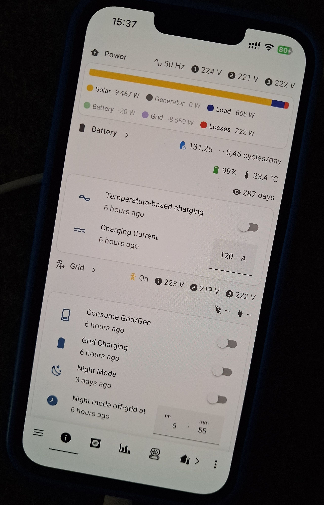
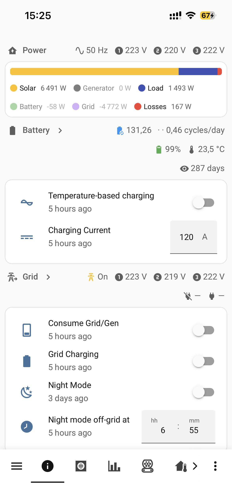
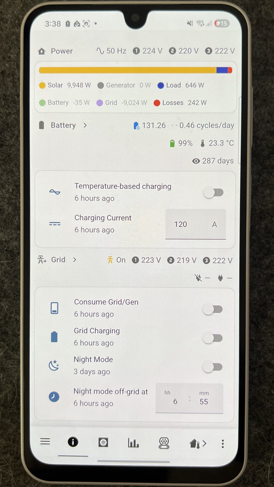
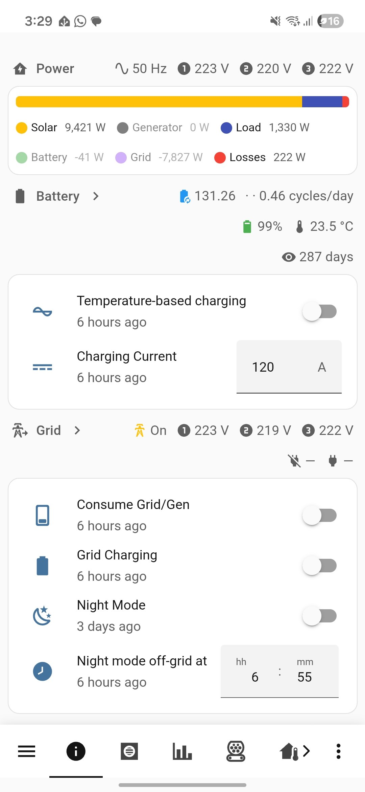
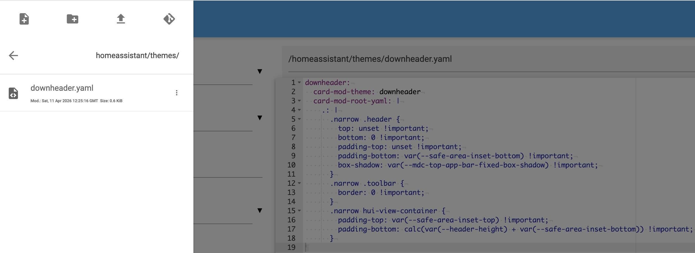
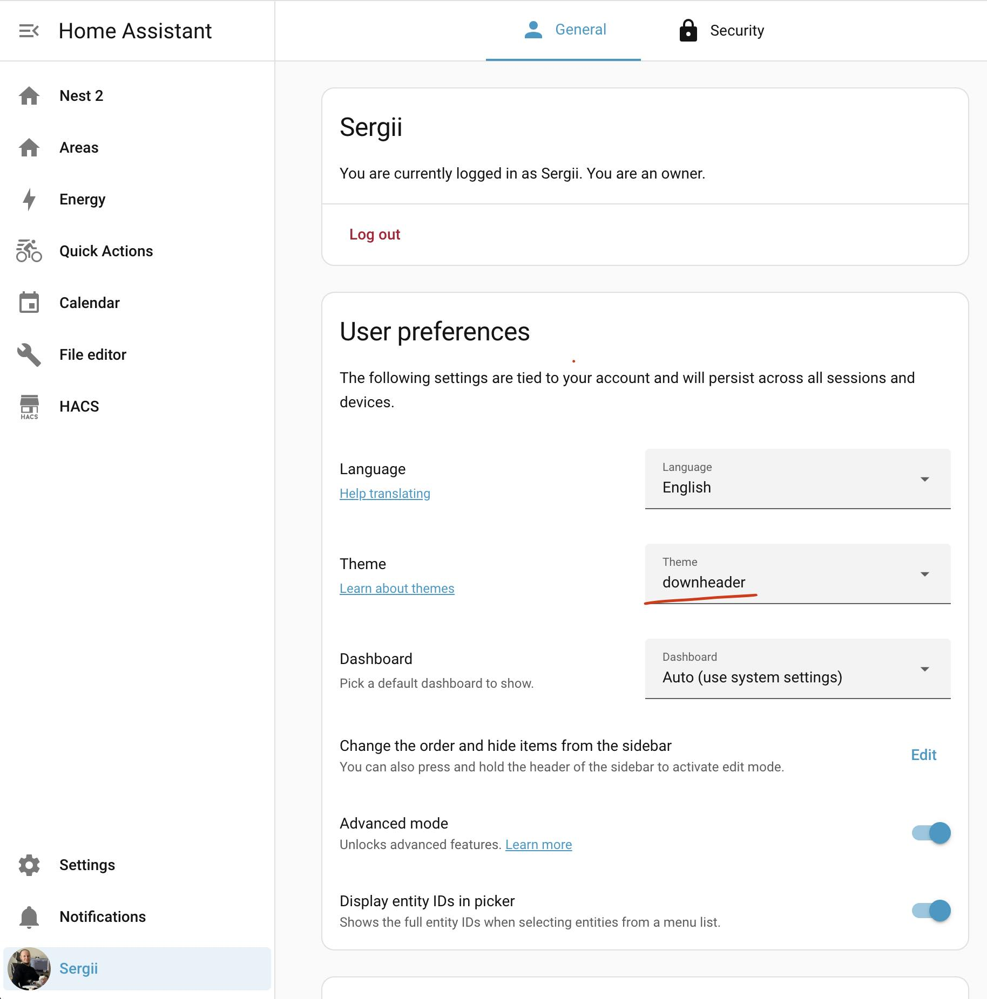

# UI: Navbar at the bottom on mobile

Applied on narrow screens (phones) only. Otherwise, stays at the top.

<details>
  <summary>🖼 <strong>See pictures</strong></summary>

<h3>iPhone 13 Pro</h3>




<h3>Samsung A26</h3>



</details>

## Known Limitations

- The solution is mostly for the user dashboards, hence won't work in sections like `Calendar`, `File Editor`, `HACS`, etc. The `Energy` is covered though.

## How To

1. Be ready to edit configs like I do using the [File Editor](https://github.com/home-assistant/addons/tree/master/configurator) app or any other way that is convenient to you.
2. Install https://github.com/thomasloven/lovelace-card-mod
3. Ensure these lines in your HA's `configuration.yaml`:
   ```yaml
   # Load frontend themes from the themes folder
   frontend:
     themes: !include_dir_merge_named themes
   ```
4. Create `themes/downheader.yaml`. Name it the way you want. Paste inside:
   ```yaml
   downheader:
     modes:
       light: {}
       dark: {}
     card-mod-theme: downheader
     card-mod-root-yaml: |
       .: |
         .narrow .header {
           top: unset !important;
           bottom: 0 !important;
           padding-top: unset !important;
           padding-bottom: var(--safe-area-inset-bottom) !important;
           box-shadow: var(--mdc-top-app-bar-fixed-box-shadow) !important;
         }
         .narrow .toolbar {
           border: 0 !important;
         }
         .narrow hui-view-container {
           padding-top: var(--safe-area-inset-top) !important;
           padding-bottom: calc(var(--header-height) + var(--safe-area-inset-bottom)) !important;
         }
     card-mod-view-yaml: |
       hui-sections-view $: |
         .narrow hui-view-footer {
           bottom: calc(var(--header-height) + 1em) !important;
         }
   ```
   
5. Restart HA either in File Editor, Developer tools, or any other way.
6. Pick the created theme for the users that wants this.
   
